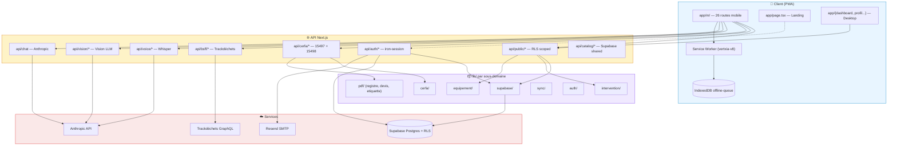

# Architecture — Vertxia (PWA F-Gas)

> Application PWA mobile-first pour techniciens frigorifiques : conformité F-Gas, génération CERFA, BSFF Trackdéchets, scan plaque, mémoire contextuelle prédictive.

**Stack** : Next.js 16 · React 19 · TypeScript strict · Supabase (Postgres + RLS) · IndexedDB (offline) · pdf-lib · framer-motion · Tailwind 4.

---

## Topologie haut niveau

```
web/
├── app/                          Next.js App Router (routes + API)
│   ├── m/                        PWA mobile-first — point d'entrée principal
│   ├── api/                      Endpoints serveur (REST)
│   ├── dashboard, profil,
│   │   equipements, historique,
│   │   syderep, bsff/            Pendant desktop des routes mobiles
│   ├── eq/[id]                   Page publique partagée d'un équipement (QR)
│   ├── auth, login, start,
│   │   admin/seed/               Onboarding + auth
│   └── page.tsx, layout.tsx      Landing publique + shell racine
│
├── components/
│   ├── mobile/                   Tous les composants de la PWA mobile
│   │   ├── ui/                       Primitives UI (tab-bar, header, signature, tile...)
│   │   ├── infra/                    Infrastructure client (SW register, auth-sync)
│   │   ├── intervention/             Contexte intervention (pannes, cross-signals, CERFA banner...)
│   │   ├── equipement/               Contexte équipement (compliance, scan plaque, search)
│   │   ├── voice/                    Dictée Whisper (intervention, équipement)
│   │   └── chat-assistant.tsx        Assistant IA (Anthropic)
│   ├── motion-primitives/        Lib animation interne (framer-motion + Lenis-free)
│   ├── ui/button.tsx             shadcn-style base button
│   └── animated-sphere,
│       intro-animation,
│       reveal-text,
│       sticky-nav                Composants visuels de la landing publique
│
├── lib/                          Logique métier (sous-domaines)
│   ├── auth/                         auth.ts, oauth.ts, session.ts, user-scope.ts, db.ts
│   ├── cerfa/                        cerfa (15497), cerfa-15498 (contrat assemblage), documents-officiels
│   ├── equipement/                   equipement, bouteille, bouteille-storage, reprise-bouteille, compliance-score
│   ├── intervention/                 intervention-storage, predictive-maintenance, context-memory, cross-signals,
│   │                                 vision-diagnostic, diagnostic-storage, diagnostic-share
│   ├── pdf/                          pdf-fonts, pdf-image, registre-pdf, devis-pdf, rapport, etiquette-tfe, qr-label
│   ├── sync/                         public-sync (cloud), offline-queue (IndexedDB), hydrate-on-login
│   ├── supabase/                     client (browser), server (RSC), middleware, anon, use-user
│   └── *.ts (racine)             Utils transverses :
│                                 env, utils, uuid, rate-limit, ssrf-guard, origin-check, jobs,
│                                 integrity-checks, qrcode-client, use-time-of-day, demo-seed,
│                                 chat-system-prompt, syderep, marketplace-pieces, devis,
│                                 geocoding, siret, profil
│
├── public/                       Assets statiques (icônes PWA, docs CERFA officiels, NotoSans)
└── store/                        (Vide — supprimé avec le pivot Lite)
```

---

## Diagramme de dépendances



---

## Conventions

### Imports
- **Toujours absolu** : `from "@/lib/cerfa/cerfa"` — jamais `from "../../lib/cerfa"`.
- Le `@/` mappe sur la racine `web/` (configuré dans `tsconfig.json`).
- Pour un fichier sibling dans le même sous-dossier, OK d'utiliser `./foo` (ex : `lib/supabase/client.ts` ← `./middleware`). Sinon absolu.

### Frontières client/serveur
- Pages dans `app/m/*` = `"use client"` par défaut.
- Endpoints `app/api/*` = serveur Node (`export const runtime = "nodejs"` quand on touche le filesystem ou pdf-lib).
- `lib/supabase/server.ts` ≠ `lib/supabase/client.ts` — utiliser celui adapté à la frontière.

### Storage
- **localStorage** : préférences UI, brouillons. Scoped per user via `scopedKey()` (lib/auth/user-scope.ts).
- **IndexedDB (`offline-queue`)** : queue d'opérations à rejouer quand le réseau revient (lib/sync/offline-queue.ts).
- **Supabase Postgres** : source de vérité (RLS), accessible côté serveur via `service_role` ou côté client via le JWT user.

### Réglementaire (F-Gas)
Chaque CERFA / BSFF / SYDEREP suit la même séparation :
- **Modèle de données** dans `lib/cerfa/`, `lib/syderep.ts`, etc.
- **Rendu PDF** dans `lib/pdf/`.
- **Endpoint API** dans `app/api/cerfa/15498` (etc.) — validation + génération.
- **UI bandeau / formulaire** dans `components/mobile/intervention/`.

### Hot fixes iOS Safari (à ne PAS oublier)
- `lib/uuid.ts` : fallback Math.random pour Safari HTTP non-secure (sinon crypto.randomUUID undefined → localStorage cassé).
- `next.config.ts` : `allowedDevOrigins` obligatoire pour test sur IP locale depuis iPhone.
- Inputs forms : `autoComplete="off"` + `data-form-type="other"` pour éviter l'autofill cross-fields.
- Pas de `initial: { opacity: 0 }` sur framer-motion en pages mobile critiques (bug hydration iOS).

---

## Routes mobiles `app/m/*` (PWA principale)

| Route | Rôle |
|---|---|
| `/m` | Home (planning du jour, raccourcis) |
| `/m/intervention` + `/m/intervention/nouvelle` | Saisie d'intervention F-Gas (CERFA 15497 + 15498) |
| `/m/equipements` + `/nouveau` | Parc équipements client |
| `/m/bouteilles` + `/[id]` + `/nouvelle` | Bouteilles fluide + mouvements (BSFF) |
| `/m/diagnostic` + `/[id]` + `/historique` | Diagnostic vision (photos défauts) |
| `/m/scan` | Scan plaque équipement (Vision LLM) |
| `/m/registre` + `/m/import-registre` | Registre F-Gas (export, import CSV) |
| `/m/syderep` | Bilan annuel SYDEREP (ADEME) |
| `/m/documents` | Documents officiels F-Gas (offline) |
| `/m/historique` + `/[id]` | Historique interventions + re-téléchargement |
| `/m/marketplace` | Catalogue pièces (Devis) |
| `/m/planning` | Planning interventions |
| `/m/infractions` | Détection infractions réglementaires |
| `/m/profil` + `/m/profil/signature` | Profil entreprise + signature stylo |
| `/m/login` | Login mobile |

---

## Tag baseline

Avant la phase de nettoyage architectural (Option C, 2026-06-06), l'état complet du repo est figé sur le tag :

```
v-pre-cleanup-2026-06-06
```

Pour revenir à cet état :
```bash
git checkout v-pre-cleanup-2026-06-06
```

Pour récupérer un fichier supprimé pendant le cleanup :
```bash
git show v-pre-cleanup-2026-06-06:web/<chemin/du/fichier>
```
